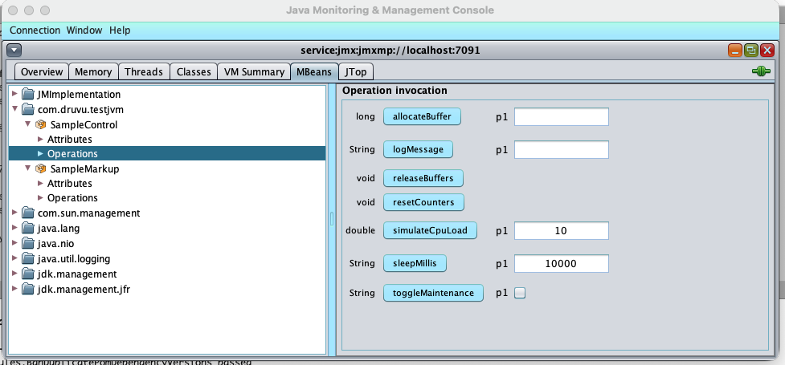
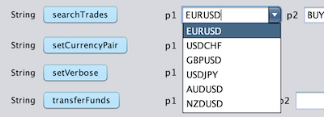
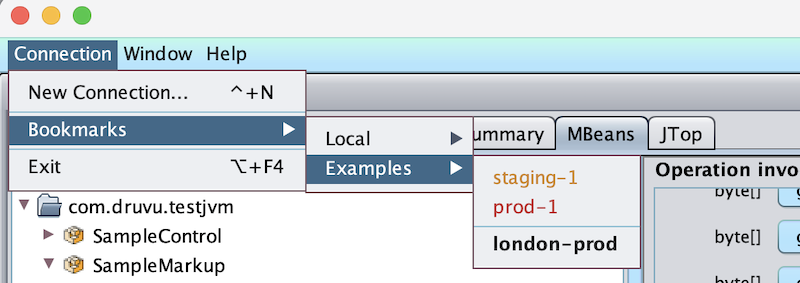

# JConsole Booster

**A maintained, modern JConsole fork for JVM ops engineers who rely on JMX in production.**

[](LICENSE)
[](https://openjdk.org/)
[](https://druvu.com/projects/jconsole-booster)
[](https://github.com/DenissLarka/jconsole-booster/releases)



## What is this?

JConsole Booster is an OpenJDK 25 fork of the standard JConsole, modernised with a Nimbus look-and-feel, configurable color theming, and a markup system that turns plain `MBeanInfo` descriptions into rich form widgets — dropdowns, date pickers, file pickers, multi-line areas. Connection bookmarks, parameter persistence, and a MIME-aware return handler round out the upgrade.

The markup system is **fully opt-in**: servers that don't add `{{...}}` markup to their descriptions behave exactly as they would under vanilla JConsole. Adding markup is safe — every other JMX client (JConsole, VisualVM, Mission Control) just shows the description as plain text.

## Highlights

- **Markup-driven Operations form.** Embed `{{combo:EUR,USD,GBP}}`, `{{date:dd.MM.yyyy}}`, `{{text:rows=10}}`, or `{{file:*.csv}}` in `MBeanParameterInfo.getDescription()` and the right widget renders automatically. Server-side opt-in; non-aware tooling shows the description verbatim.
- **MIME-aware `byte[]` returns.** `{{returns:mime=application/pdf}}` on an operation makes the result open in your PDF viewer instead of showing as a hex blob. Whitelist of safe content types; everything else falls through to a save dialog with an explicit warning.
- **Per-parameter value persistence.** Last-used parameter values are remembered per `(MBean class, operation, parameter)` and pre-filled on next open. Stop retyping the same JSON payload forty times per debugging session.
- **Connection bookmarks menu.** A hand-editable text file at `~/.druvu.com/jconsole-booster/connections.txt` populates a bookmarks menu with grouping, bold/colored items, and the same `host:port` shorthand you use on the command line. Syncable across machines via Dropbox / git / your tool of choice.
- **Smarter `TabularData` viewer.** `TabularData` results are sorted by the columns named in JMX-canonical `TabularType.getIndexNames()`, with key columns rendered in italics. No more 200-row scroll-fests in insertion order.
- **Modern Nimbus UI with one-line color theming.** Cross-platform consistent rendering; pass `-c=#RRGGBBAA` on launch to set the theme color.
- **JMXMP transport.** Single TCP port, tunnel-friendly (perfect for SSH-forwarded production debugging), no RMI dynamic-port surprises through firewalls.
- **OpenJDK 25 ready, JPMS module.** Runs on the latest JDK; ships as a proper module (`com.druvu.jconsole`).

## Install

### Build from source (current path)

Requires JDK 25+ and Maven 3.9+.

```bash
git clone https://github.com/DenissLarka/jconsole-booster.git
cd jconsole-booster
mvn clean package
mvn exec:exec@start
```

The application's main entry point is `com.druvu.jconsole.launcher.JConsole`. The launcher applies the Nimbus look-and-feel, parses CLI arguments via `ArgumentParser` (including the `-c=` color flag and `host:port` URL shorthand), and then runs the main JConsole UI on the EDT.

> **Pre-built installers** (`.msix`, `.dmg`, `.AppImage`) are produced from a separate dist pipeline and will be code-signed and notarized in upcoming releases. While signing certificates are being procured, unsigned canary builds may be attached to [GitHub Releases](https://github.com/DenissLarka/jconsole-booster/releases) for pipeline validation — they will trigger Gatekeeper / SmartScreen warnings on most machines. For general use, build from source until signed installers land.

## Quick start

Launch JConsole Booster against a JVM you've prepared with JMXMP enabled (see the next section):

```
jconsole-booster localhost:7091
```

The bare `host:port` form expands to `service:jmx:jmxmp://host:port`. Multiple targets connect in tiled MDI panels:

```
jconsole-booster localhost:7091 prod-host:7091 staging-host:7091
```

Apply a custom color theme:

```
jconsole-booster -c=#5B9BD5 localhost:7091
```

## Configuring your JVM

JConsole Booster connects exclusively over **JMXMP** (JMX Messaging Protocol) — chosen deliberately for properties that matter in production:

- **Single TCP port.** No RMI second-port dynamics; firewall rules are one line.
- **Tunnel-friendly.** `ssh -L 7091:localhost:7091 prod-host` and you are done.
- **No registry round-trip.** One connection, one socket.

The standard `-Dcom.sun.management.jmxremote.port=…` system property starts an **RMI** connector, not JMXMP, and will not work with JConsole Booster's `host:port` shorthand. Local-process attach is intentionally unsupported — every connection is an explicit JMX URL, and there are no surprises about which JVM you just connected to.

To start a JMXMP connector server in your target JVM, add `jmxremote_optional` to the classpath and start the connector explicitly:

```java
JMXConnectorServerFactory.newJMXConnectorServer(
    new JMXServiceURL("service:jmx:jmxmp://0.0.0.0:7091"),
    null,
    ManagementFactory.getPlatformMBeanServer()
).start();
```

The `jmxremote_optional` artifact ships from GlassFish:

```xml
<dependency>
    <groupId>org.glassfish.main.external</groupId>
    <artifactId>jmxremote_optional-repackaged</artifactId>
    <version>5.0</version>
</dependency>
```

## Markup reference

JConsole Booster scans `MBeanParameterInfo.getDescription()` and `MBeanOperationInfo.getDescription()` for a small markup vocabulary in `{{tag:options}}` form. A description may contain at most one tag; everything outside the `{{...}}` is treated as the human-readable description and shown as the tooltip — the markup itself is stripped, never leaked into the UI.

### Parameter widgets

| Tag                                    | Widget                              | Example                                          |
|----------------------------------------|-------------------------------------|--------------------------------------------------|
| `{{combo:A,B,C}}`                      | Dropdown of fixed values            | `"Currency pair {{combo:EURUSD,USDCHF,GBPUSD}}"` |
| `{{date:format}}`                      | Date picker                         | `"Settle date {{date:dd.MM.yyyy}}"`              |
| `{{text}}` / `{{text:rows=N}}`         | Multi-line text area (default 8×60) | `"Payload {{text:rows=10}}"`                     |
| `{{file}}` / `{{file:*.csv,*.json}}`   | File picker                         | `"Upload {{file:*.csv}}"`                        |

`boolean`-typed parameters render as checkboxes automatically — no markup needed.

`{{file}}` reads the picked file as bytes when the parameter type is `byte[]`, or as a UTF-8 string when the parameter type is `String`. The filter pattern is comma-separated globs.

`{{combo}}` values cannot themselves contain commas (commas are the value separator).

### Operation result hints

| Tag                       | Effect                                              | Example                                             |
|---------------------------|-----------------------------------------------------|-----------------------------------------------------|
| `{{returns:format=json}}` | Pretty-print the result in a monospace area         | `"Server config {{returns:format=json}}"`           |
| `{{returns:mime=<type>}}` | Open `byte[]` result with the OS handler            | `"Monthly report {{returns:mime=application/pdf}}"` |

`{{returns:format=json}}` applies when the return type is `String` / `CharSequence`. Failed parse falls back to the raw string with a one-line warning above the area.

`{{returns:mime=...}}` applies when the return type is `byte[]`. The whitelist for auto-open is:

```
application/pdf       application/json      application/xml
application/zip       text/plain            text/csv
text/html             image/png             image/jpeg
image/gif             image/svg+xml
```

Anything outside the whitelist triggers a confirmation dialog warning that files of unknown type may be unsafe; on confirm, a `JFileChooser` is shown with a suggested extension.

### Example: a markup-aware MBean

To carry custom descriptions into `MBeanInfo`, use a `StandardMBean` subclass that overrides `getDescription(...)`. With a plain interface-based Standard MBean, JMX introspection generates default descriptions like `p1`, `p2`, … and your markup never reaches the wire.

```java
public class OrderService extends StandardMBean implements OrderServiceMBean {

    public OrderService() throws NotCompliantMBeanException {
        super(OrderServiceMBean.class);
    }

    @Override
    protected String getDescription(MBeanOperationInfo op, MBeanParameterInfo p, int seq) {
        return switch (op.getName()) {
            case "setPair"     -> "Currency pair {{combo:EURUSD,USDCHF,GBPUSD,USDJPY}}";
            case "scheduleAt"  -> "Run-at date {{date:dd.MM.yyyy}}";
            case "uploadCsv"   -> "CSV file {{file:*.csv}}";
            default            -> super.getDescription(op, p, seq);
        };
    }

    @Override
    protected String getDescription(MBeanOperationInfo op) {
        return switch (op.getName()) {
            case "generateReport" -> "Monthly report {{returns:mime=application/pdf}}";
            case "getConfig"      -> "Server config {{returns:format=json}}";
            default               -> super.getDescription(op);
        };
    }

    public String setPair(String pair) { /* ... */ }
    public String scheduleAt(String date) { /* ... */ }
    public String uploadCsv(byte[] payload) { /* ... */ }
    public byte[] generateReport() { /* ... */ }
    public String getConfig() { /* ... */ }
}
```

A `DynamicMBean` that hand-builds `MBeanInfo` with explicit `MBeanParameterInfo(name, type, description)` is the alternative.

## Connection bookmarks

The bookmarks menu is populated from a plain text file:

```
~/.druvu.com/jconsole-booster/connections.txt
```

A default file is written on the first launch with documented examples. Format:

```
# Comments start with #. Empty lines are ignored.

[PRODUCTION]
order-service@prod-orders:7091
*high-traffic*@prod-mkt:7091
[red ALERT host]@prod-edge:7091
---
billing@prod-billing:7091

[STAGING]
order-service@staging-orders:7091
billing@staging-billing:7091

[LOCAL]
local@localhost:7091
```

| Line                            | Effect                          |
|---------------------------------|---------------------------------|
| `[GROUP NAME]`                  | Submenu header                  |
| `name@host:port`                | Menu item                       |
| `*name*@host:port`              | Bold menu item                  |
| `[<color> name]@host:port`      | Colored menu item               |
| `---`                           | Separator within a group        |

Allowed colors: `red`, `blue`, `green`, `orange`, `gray`, `black`, `purple`. Unknown color names render verbatim with a one-line `WARN` log.

URLs accept the same shorthand the rest of the app accepts: `host:port` is expanded to JMXMP, full `service:jmx:…` URLs are passed through unchanged. Malformed lines log a warning naming the line number rather than failing silently.

## Files & paths

JConsole Booster keeps its state in a single hidden vendor directory under your home:

```
~/.druvu.com/jconsole-booster/
├── connections.txt                                       ← bookmarks
└── operation-state/
    └── <fully.qualified.MBeanClassName>.properties      ← last-used parameter values
```

Cross-platform without conditionals — `~` (i.e. `System.getProperty("user.home")`) resolves correctly on macOS, Windows, and Linux. The directory is created lazily on first need; deleting it resets that state without breaking the app.

To relocate the directory (e.g. point it at a Dropbox / iCloud / OneDrive synced path), set the **`JCONSOLE_BOOSTER_HOME`** environment variable. If set, it overrides the default path entirely.

## Screenshots

### Markup-driven Operations form


*An operation parameter described as `"Currency pair {{combo:EURUSD,USDCHF,GBPUSD}}"` renders as a dropdown — the markup itself is invisible, only the prose remains in the tooltip.*

### Connection bookmarks menu


*A `connections.txt` with grouping, bold items, and inline color tags rendered into the menu.*


## CLI reference

```
jconsole-booster [options] [target ...]
```

### Targets

| Form                       | Expands to                                     |
|----------------------------|------------------------------------------------|
| `host:port`                | `service:jmx:jmxmp://host:port`                |
| `service:jmx:…`            | passed through unchanged (JMXMP, RMI, custom)  |

Multiple targets open in tiled MDI panels (use `-notile` to disable). Bare process IDs are not supported — every target is an explicit URL.

### Options

| Flag                | Description                                                        |
|---------------------|--------------------------------------------------------------------|
| `-c=#RRGGBB[AA]`    | Apply a Nimbus color theme (sets the `nimbusBlueGrey` base color). |
| `-interval=N`       | Refresh interval in seconds. Default: `4`.                         |
| `-notile`           | Don't tile windows when multiple targets are passed.               |
| `-debug`            | Enable debug logging.                                              |
| `-version`          | Print version and exit.                                            |
| `-fullversion`      | Print full version (with build metadata) and exit.                 |
| `-h`, `-help`, `-?` | Print usage and exit.                                              |

## JConsole Booster vs vanilla JConsole

|                            | Vanilla JConsole                                        | JConsole Booster                                                       |
|----------------------------|---------------------------------------------------------|------------------------------------------------------------------------|
| Look-and-feel              | OS-default (often dated)                                | Nimbus, cross-platform consistent                                      |
| Color theming              | None                                                    | `-c=#RRGGBBAA`                                                         |
| Operations form            | Plain text fields only                                  | `{{markup}}` → dropdowns, date pickers, file pickers, multi-line areas |
| `byte[]` operation returns | `[B@1a2b3c]`                                            | MIME-aware open / save with extension hint                             |
| `TabularData` viewer       | Insertion order, no key cue                             | Sorted by `TabularType.getIndexNames()`, italic key columns            |
| Parameter persistence      | None                                                    | Last-used values per `(MBean class, op, param)`                        |
| Connection bookmarks       | None                                                    | Text-file driven, groupable, colorable                                 |
| Transport                  | RMI (multi-port, hostile to firewalls)                  | JMXMP (single port, tunnel-friendly)                                   |
| JDK                        | Bundled with JDK 8/11/17 (deprecated and removed in 9+) | OpenJDK 25 fork, modern Java                                           |
| Local-process attach       | Yes                                                     | No (explicit URLs only — no surprise connections)                      |

## Compatibility

- **Java runtime.** OpenJDK 25 or later. Bundled with the installer — no separate install needed.
- **Operating systems.**
  - Windows 10 / 11 (x64)
  - macOS 12 Monterey or later (Intel and Apple Silicon)
  - Linux x64 (any modern glibc-based distribution)
- **Target JVMs.** Any JVM exposing JMX over JMXMP — JDK 8 through latest. Markup features require the target's MBeans to populate `MBeanInfo` descriptions accordingly (`StandardMBean` subclass overriding `getDescription(...)`, or a `DynamicMBean` hand-building `MBeanInfo`).
- **JPMS.** Ships as the `com.druvu.jconsole` module.

## Maven artifact (for embedding / extending)

The `com.druvu:jconsole-booster` JAR is published to **GitHub Packages**. This is only relevant if you want to embed JConsole Booster in another Maven project or write a JConsole plugin against its APIs — end users should use the installers above.

GitHub Packages requires authentication even for public packages. Generate a [Personal Access Token](https://github.com/settings/tokens) with the `read:packages` scope, then add a server entry to `~/.m2/settings.xml`:

```xml
<settings>
  <servers>
    <server>
      <id>github</id>
      <username>YOUR_GITHUB_USERNAME</username>
      <password>YOUR_PAT_WITH_read:packages</password>
    </server>
  </servers>
</settings>
```

Add the repository and dependency to your consumer project's `pom.xml`:

```xml
<repositories>
  <repository>
    <id>github</id>
    <url>https://maven.pkg.github.com/DenissLarka/jconsole-booster/</url>
  </repository>
</repositories>

<dependency>
  <groupId>com.druvu</groupId>
  <artifactId>jconsole-booster</artifactId>
  <version>1.0.0</version>
</dependency>
```

## License

JConsole Booster is licensed under the **GNU General Public License v2 with the Classpath Exception**, inherited from upstream OpenJDK JConsole. See [LICENSE](LICENSE) for the full text.

## Part of the druvu.com toolkit

JConsole Booster is part of [druvu.com](https://druvu.com) — Java tooling for finance and the JVM. See [druvu.com](https://druvu.com) for the rest of the toolkit.

Issues and pull requests are welcome at [github.com/DenissLarka/jconsole-booster](https://github.com/DenissLarka/jconsole-booster).
